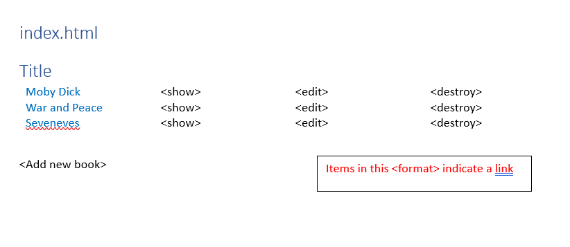
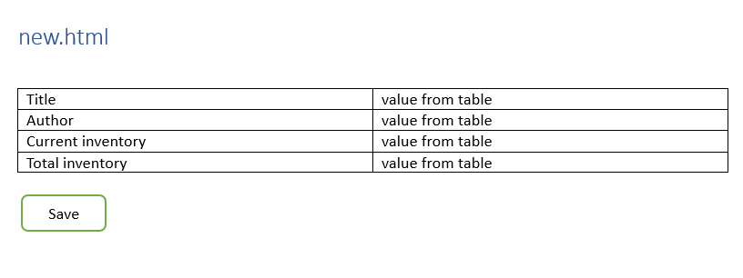
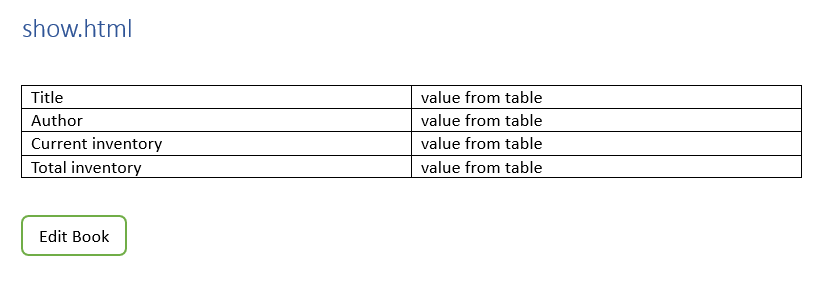
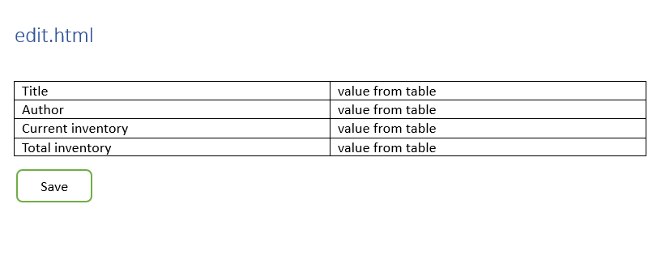

## Testing Documentation

[Link to test cases](https://docs.google.com/spreadsheets/d/1Wq2QpRsI7kZvhpyn0CMIs3TxBe4GH42GmQyCYfll_FI/edit?usp=sharing)

### Unit Tests

Unit tests are located at `./library/spec/models/books_spec.rb`

### UI Tests

UI tests are located at `./library/spec/ui/*_spec.rb`

### API Tests

API tests are located at `./library/spec/api/*_spec.rb`

### Performance Tests

### Wireframes

#### index.html

#### new.html

#### show.html

#### edit.html

